# Aprūpes sistēma — ekrānuzņēmumi

Šie ekrānuzņēmumi ir ģenerēti automātiski ar `docs/screenshots.js`.
Tostuļojiet tos kopā ar aprakstiem, lai izveidotu aprūpētāju instrukcijas.

## Sanākumā

| # | Ekrānuzņēmums | Apraksts |
|---|---------------|----------|
| 1 |  | Sākumlapa ar logotipu (spalšs ekrāns) |
| 2 | 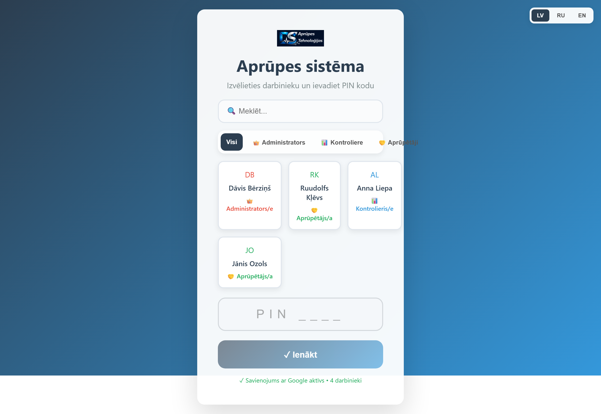 | Pieteikšanās ekrāns — darbinieku saraksts ar lomu filtru |
| 3 | 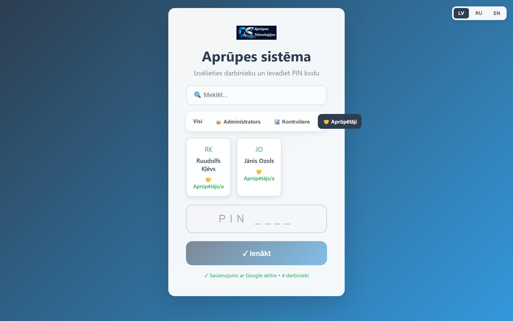 | Darbinieku filtrēšana pēc lomas — tikai aprūpētāji |
| 4 | 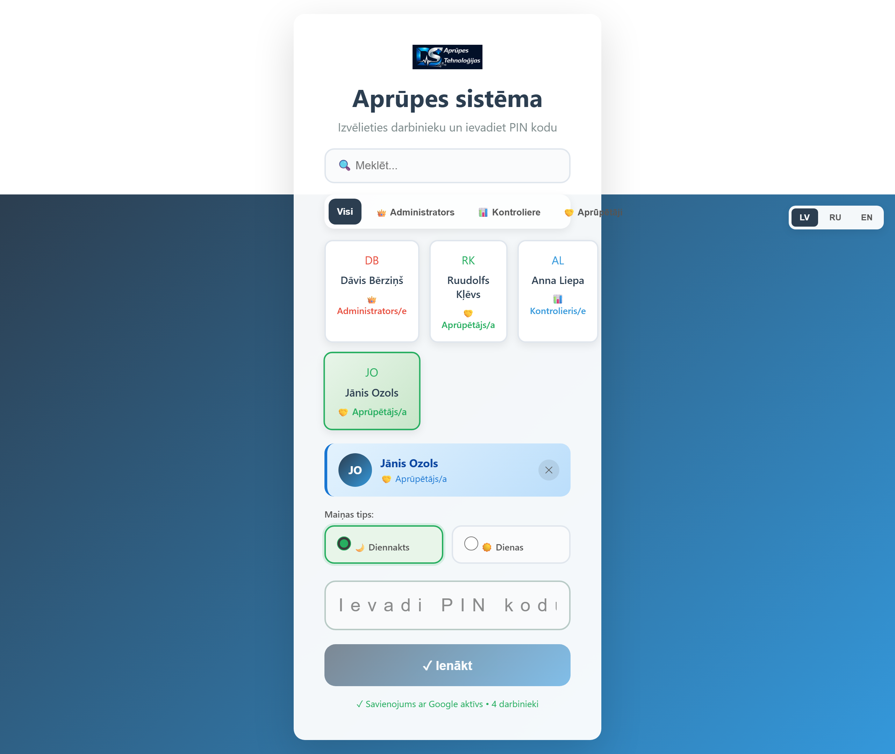 | Darbinieks izvēlēts — ievadiet PIN kodu (4–6 cifri) |
| 5 | 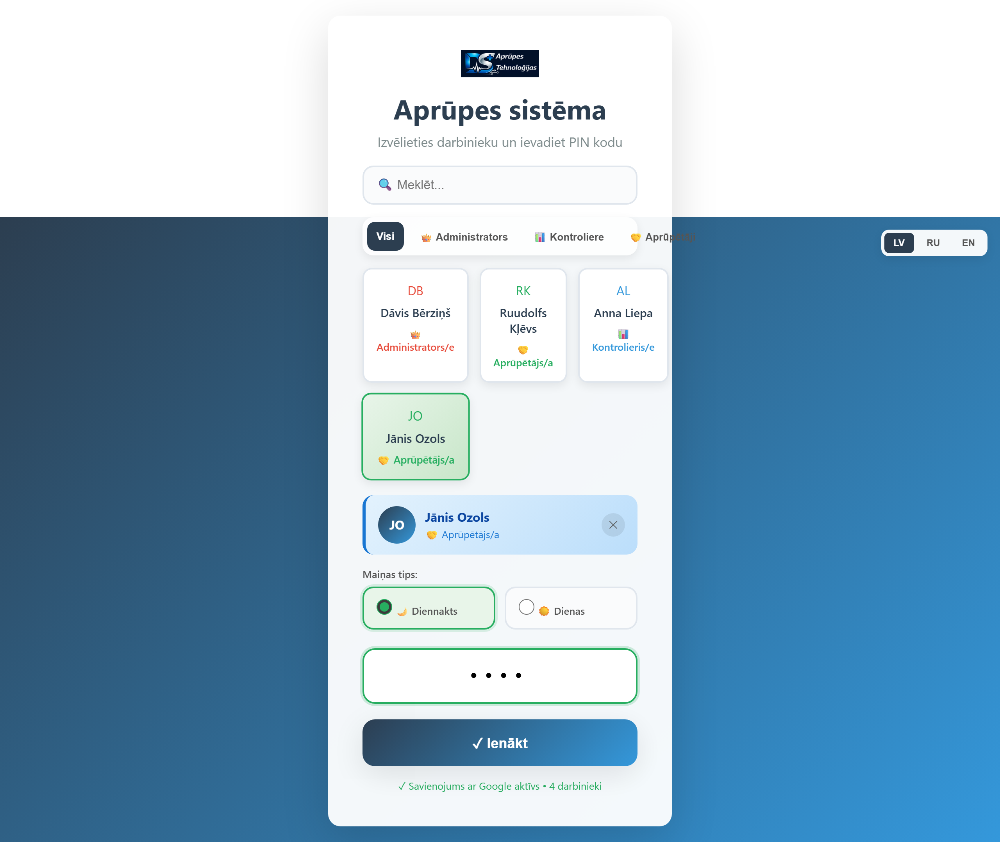 | PIN kods ievadīts — spiediet "Ienākt" |
| 6 | 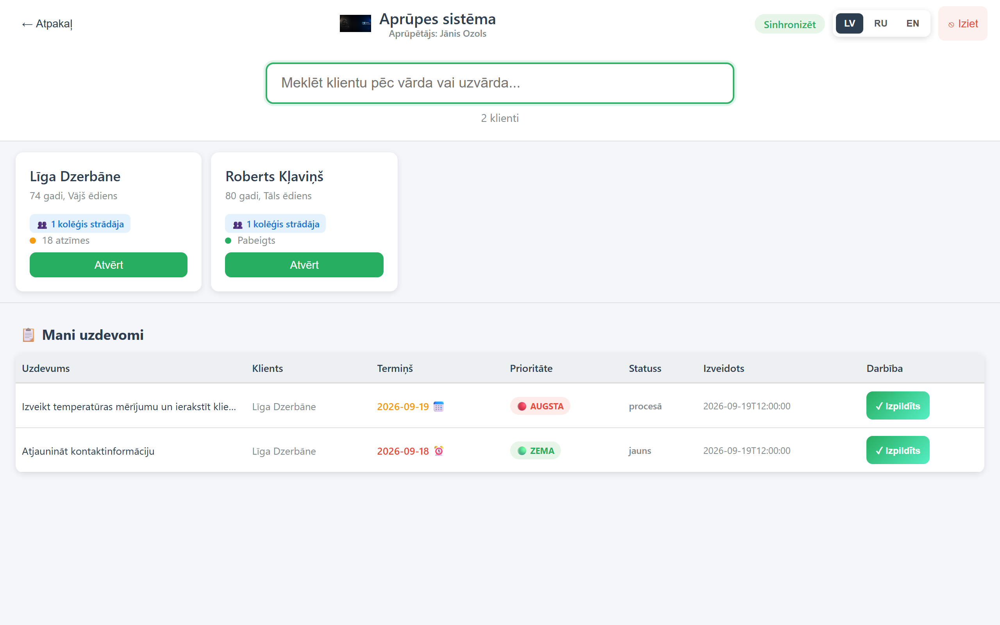 | Aprūpētāja sākumlapa — klientu saraksts ar statusa indikatoriem |
| 7 | 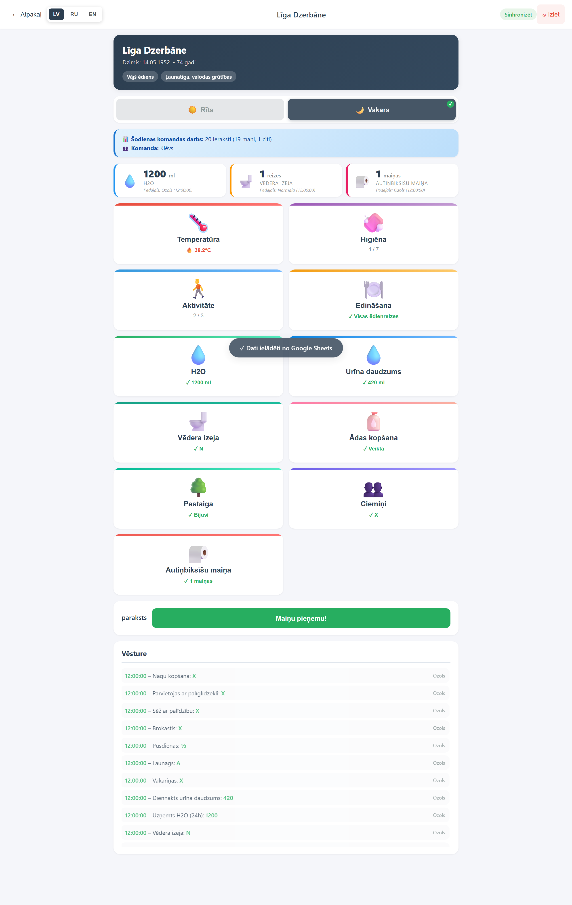 | Klienta aprūpes forma — kategoriju rīkjons, kas ir jāaizpilda |
| 8 | 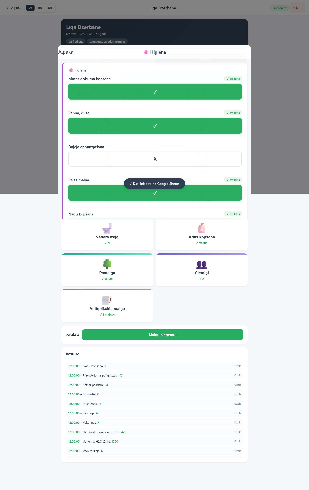 | Higiēna — pārslēgļi (X = izdarīts) |
| 9 | 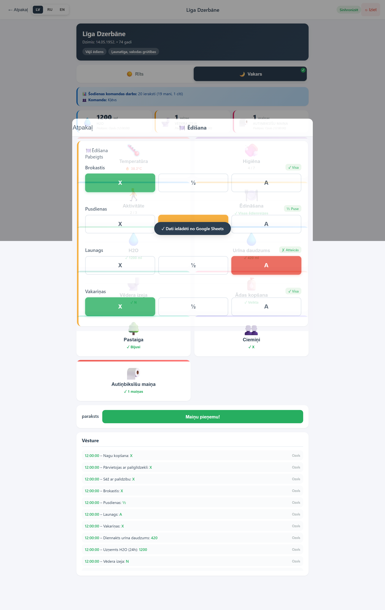 | Ēdīšana — ēdienrežu režīsti (X=pilna, ½=puse, A=atteikšanās) |
| 10 | 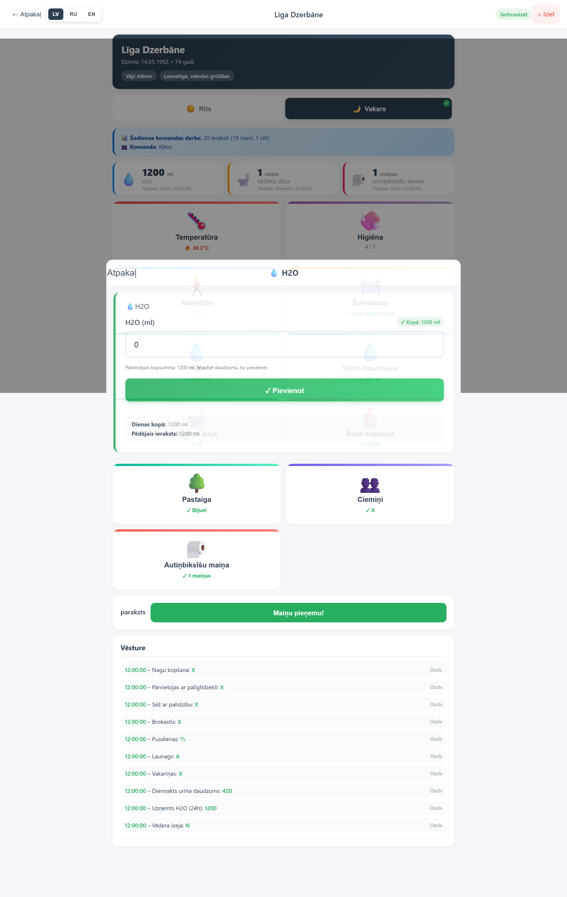 | Šķidrumi — urīns un patērētais ūdens (ml), kopsavilkums zemājā daļā |
| 11 | 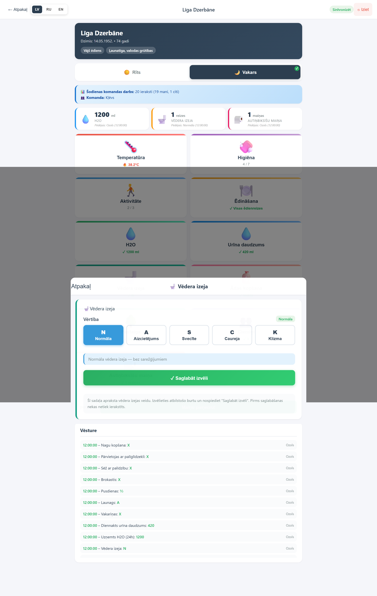 | Vēdera izeja — izvēlieties stāvokli (N/A/S/C/K) un saglabājiet |
| 12 | 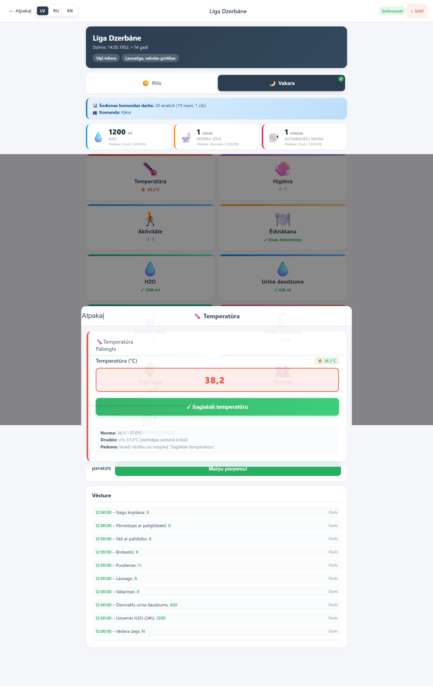 | Temperatūra — ievadiet skaitli °C (37°C+ dzidina sarkanā) |
| 13 | 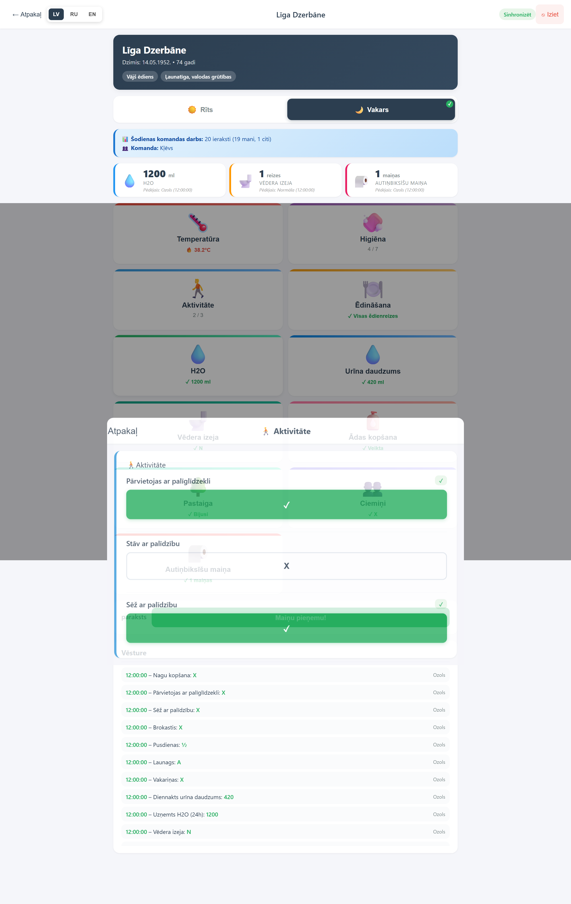 | Aktivitāte — kustība ar palīdzību (pārslēgļi X) |
| 14 | 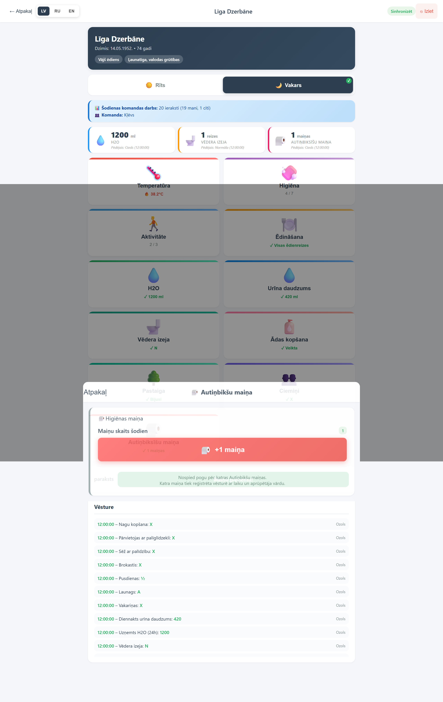 | Pārējās darbības — ādas kopšana, pastaiga, ciemiņi, autiņbiksu maiņa (+1) |
| 15 | 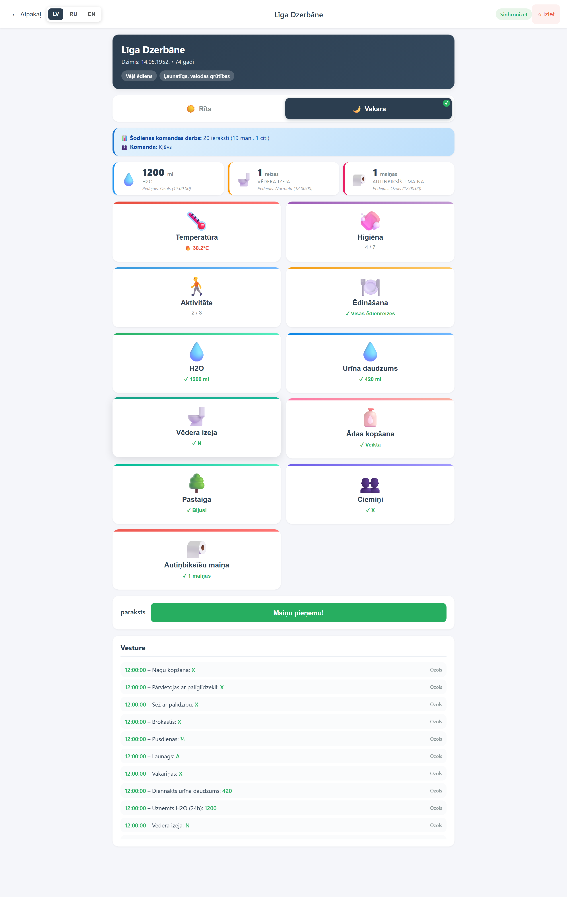 | Paraksts — aktīvā maiņa nav parakstīta, poga ir aktīva |
| 16 | 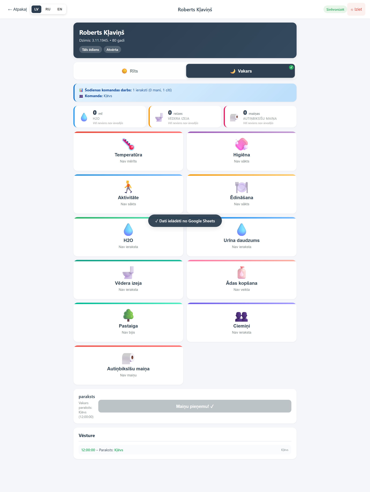 | Paraksts ir bloķēts — kāds cits jau ir parakstījis šo maiņu |

## Darbību plūsmas pāreja

1. **Pieteikšanās** — atlasiet darbinieku no saraksta un ievadiet PIN kodu.
2. **Aprūpētāja sākumlapa** — atlasiet klientu, spiediet "Atvērt".
3. **Aprūpes forma** — katru dienu aizpildiet kategorijas (temperatūra, higiēna, ēdīšana, šķidrumi, fizioloģija, citi).
4. **Paraksts** — nospiediet "Maiņu nododu/pieņemu", kad visi ieraksti ir veikti.
5. Ja kāds cits jau ir parakstījis, poga tiek bloķēta — katram klientam vienā maiņā ir tikai viens paraksts.

